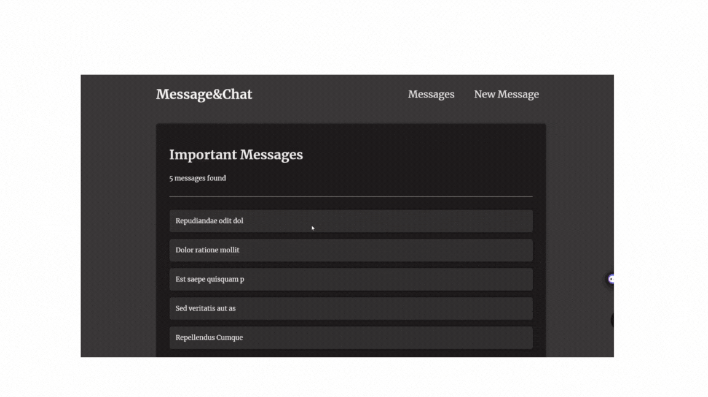

# Messaging & Chat Upload App

## Overview

The **Messaging & Chat Upload App** is a dynamic web application designed to facilitate seamless communication between users through messaging and chat features. The app allows users to send and receive messages and includes the capability to upload and share files within the chat environment. This project is built using Next.js with a focus on server-side rendering, dynamic routing, and efficient data management using SQLite.

## Table of Contents

- [Messaging \& Chat Upload App](#messaging--chat-upload-app)
  - [Overview](#overview)
  - [Table of Contents](#table-of-contents)
  - [Features](#features)
  - [Folder Structure](#folder-structure)
  - [Getting Started](#getting-started)
    - [Prerequisites](#prerequisites)
    - [Installation](#installation)
  - [Usage](#usage)
    - [Home Page](#home-page)
    - [Messages](#messages)
    - [New Message](#new-message)
    - [Header](#header)
  - [Backend Implementation](#backend-implementation)
    - [API Endpoints](#api-endpoints)
  - [License](#license)
    - [Gif](#gif)
  - [](#)
  - [Start](#start)
  - [Learn More](#learn-more)
  - [Deploy on Vercel](#deploy-on-vercel)

## Features

- **Messaging System**: Send and receive messages in real-time.
- **Chat Uploads**: Upload and share files within the chat.
- **Next.js Integration**: Utilizes Next.js features like server-side rendering and dynamic routing.
- **SQLite Database**: Manages messages using SQLite for quick and reliable storage.
- **Optimized Caching**: Advanced caching strategies for efficient data retrieval.
- **Customizable Layout**: Modular components and layouts for easy customization.

## Folder Structure

```
📦 Messaging & Chat Upload App
├── 📁app
│   ├── 📁messages
│   │   ├── 📁new
│   │   │   └── page.js
│   │   ├── layout.js
│   │   └── page.js
│   ├── globals.css
│   ├── icon.png
│   ├── layout.js
│   └── page.js
├── 📁components
│   ├── 📁header
│   │   └── header.js
│   ├── 📁messages
│   │   └── messages.js
├── 📁messages
│   └── messages.js
├── backend
│   ├── node_modules
│   ├── package-lock.json
│   ├── package.json
├── node_modules
├── public
├── .gitignore
├── .eslintrc.json
├── jsconfig.json
├── package-lock.json
├── package.json
├── README.md
├── messages.db
└── next.config.mjs
```

## Getting Started

### Prerequisites

- **Node.js**: Ensure Node.js is installed on your machine.
- **SQLite**: SQLite database is used for managing messages.

### Installation

1. **Clone the repository**:

   ```bash
   git clone https://github.com/yourusername/messaging-chat-upload-app.git
   cd messaging-chat-upload-app
   ```

2. **Install dependencies**:

   ```bash
   npm install
   ```

3. **Set up the SQLite database**:
   The app uses an SQLite database named `messages.db`. Ensure the database is correctly initialized:

   ```bash
   npm run setup-db
   ```

4. **Start the development server**:

   ```bash
   npm run dev
   ```

5. **Start the backend server**:
   Navigate to the `backend` directory and run the backend server:
   ```bash
   cd backend
   node app.js
   ```

## Usage

### Home Page

- Located at `app/page.js`.
- Welcomes users and provides an overview of the app’s messaging and chat upload capabilities.

### Messages

- View all messages at `/messages` (`app/messages/page.js`).
- The `MessagesLayout` component (`app/messages/layout.js`) fetches and displays the total number of messages.
- The `MessagesPage` component dynamically fetches messages from the SQLite database.

### New Message

- Add a new message through the `/messages/new` route (`app/messages/new/page.js`).
- Form submission triggers server-side logic to store the message and redirect back to the messages list.

### Header

- The `Header` component (`components/header/header.js`) provides navigation links to the home page, messages list, and the new message form.

## Backend Implementation

The backend server is implemented using Express.js and serves as the API for fetching and adding messages.

### API Endpoints

- **GET /messages**: Retrieves a list of messages from the database.
- **POST /messages**: Adds a new message to the database (handled via form submission).

The server runs on `http://localhost:8080` and interacts with the front end to manage message data.

## License

This project is licensed under the MIT License. See the [LICENSE](LICENSE) file for more details.

---

### Gif

Here is an expected gif of the preview of the App(Messaging and Chat Upload)

## 

This is a [Next.js](https://nextjs.org/) project bootstrapped with [`create-next-app`](https://github.com/vercel/next.js/tree/canary/packages/create-next-app).

## Start

First, run the development server:

```bash
npm run dev
# or
yarn dev
# or
pnpm dev
# or
bun dev
```

Open [http://localhost:3000](http://localhost:3000) with your browser to see the result.

You can start editing the page by modifying `app/page.js`. The page auto-updates as you edit the file.

This project uses [`next/font`](https://nextjs.org/docs/basic-features/font-optimization) to automatically optimize and load Inter, a custom Google Font.

## Learn More

To learn more about Next.js, take a look at the following resources:

- [Next.js Documentation](https://nextjs.org/docs) - learn about Next.js features and API.
- [Learn Next.js](https://nextjs.org/learn) - an interactive Next.js tutorial.

You can check out [the Next.js GitHub repository](https://github.com/vercel/next.js/) - your feedback and contributions are welcome!

## Deploy on Vercel

The easiest way to deploy your Next.js app is to use the [Vercel Platform](https://vercel.com/new?utm_medium=default-template&filter=next.js&utm_source=create-next-app&utm_campaign=create-next-app-readme) from the creators of Next.js.

Check out our [Next.js deployment documentation](https://nextjs.org/docs/deployment) for more details.
